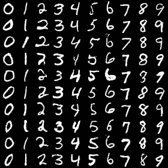
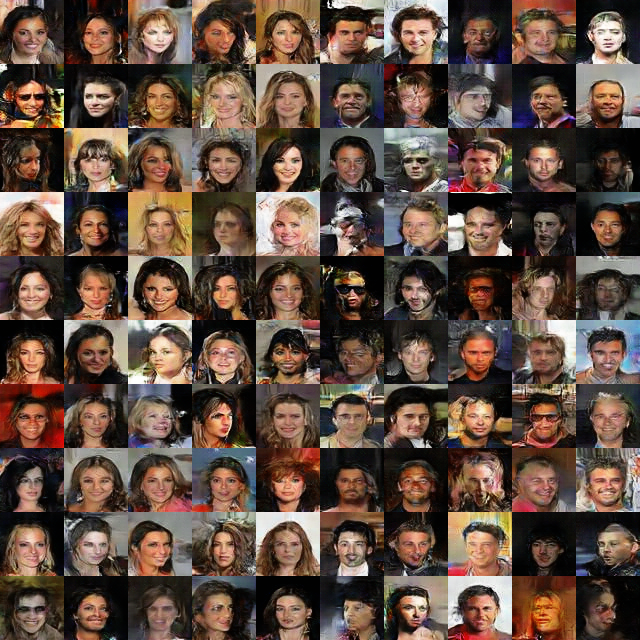

# cGAN-cDCGAN training

## Prerequisite

* Download CelebA dataset.
* Unzip and put all .jpg in `dataset/CelebA/Img/img_align_celeba/`
* Downlaod `list_attr_celeba.txt` and put it in `dataset/CelebA/`
* Run `code/tensorflow-MNIST-cGAN-cDCGAN/tools/celeba_resize.py`

## Running

* Install `nvidia-docker`
* Run `./builddocker.sh`
* Run `./rundocker.sh`
* In your web browser, connect to localhost:6006 to launch Jupyter
* Click `code/tensorflow-MNIST-cGAN-cDCGAN`
* Create any notebook and launch `%run -i '(python script name)' (any run name you want)` to start training 
* Check out the training intermediate results in tensorboard at `https://localhost:8888/`

Here are the list of python scripts

* `tensorflow_CelebA_cDCGAN.py` : train CelebA using cDCGAN
* `tensorflow_MNIST_cDCGAN.py` : train MNIST using cDCGAN
* `tensorflow_MNIST_cGAN.py` : train MNIST using cGAN

## Warning
CelebA training requires very high VRAM. 12GB would suffice.

## Models
You can download pre-trained models from https://mega.nz/#F!OzgwHL5S

## Checking FID of model
unzip the model and put each folder to `checkpoints/`

`%run -i 'tensorflow_MNIST_cGAN.py' cgan-fid-every-epoch`
`%run -i 'tensorflow_MNIST_cDCGAN.py' cdcgan-mnist-base2`
`%run -i 'tensorflow_CelebA_cDCGAN.py' cdcgan-celebA-fid-every-epoch`

## References

@znxlwm 's codes https://github.com/znxlwm/tensorflow-MNIST-cGAN-cDCGAN
@bioinf-jku 's codes https://github.com/znxlwm/tensorflow-MNIST-cGAN-cDCGAN

Heusel, M., Ramsauer, H., Unterthiner, T., Nessler, B., & Hochreiter, S. (2017). Gans trained by a two time-scale update rule converge to a local nash equilibrium. In Advances in Neural Information Processing Systems (pp. 6629-6640).

Mirza, M., & Osindero, S. (2014). Conditional generative adversarial nets. arXiv preprint arXiv:1411.1784.

Radford, A., Metz, L., & Chintala, S. (2015). Unsupervised representation learning with deep convolutional generative adversarial networks. arXiv preprint arXiv:1511.06434.

Y. LeCun, L. Bottou, Y. Bengio, and P. Haffner. "Gradient-based learning applied to document recognition." Proceedings of the IEEE, 86(11):2278-2324, November 1998.

Liu, Z., Luo, P., Wang, X., & Tang, X. (2015). Deep learning face attributes in the wild. In Proceedings of the IEEE International Conference on Computer Vision (pp. 3730-3738).
